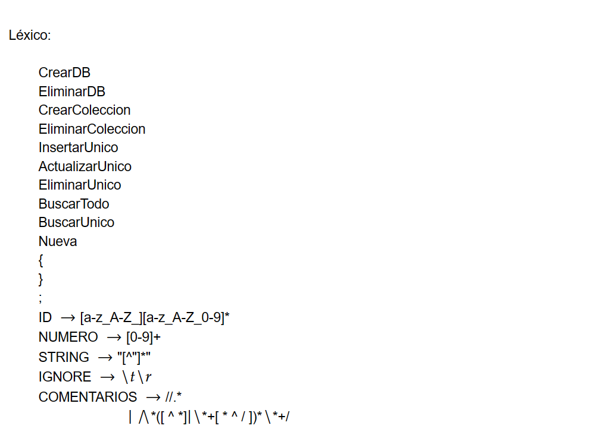
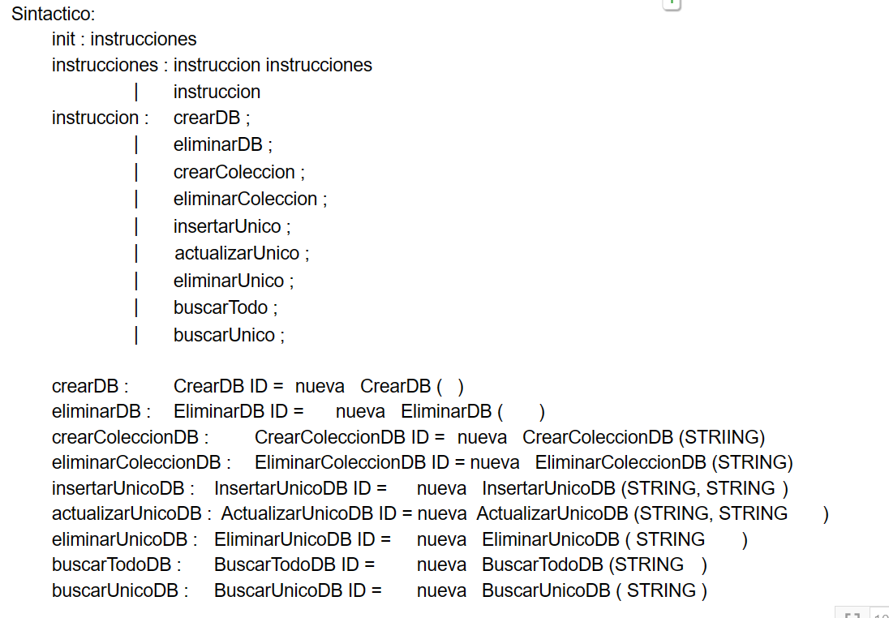
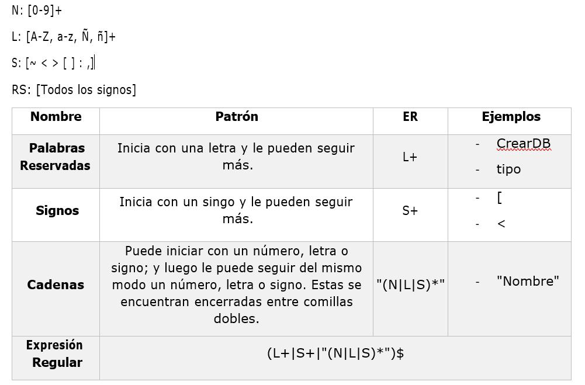
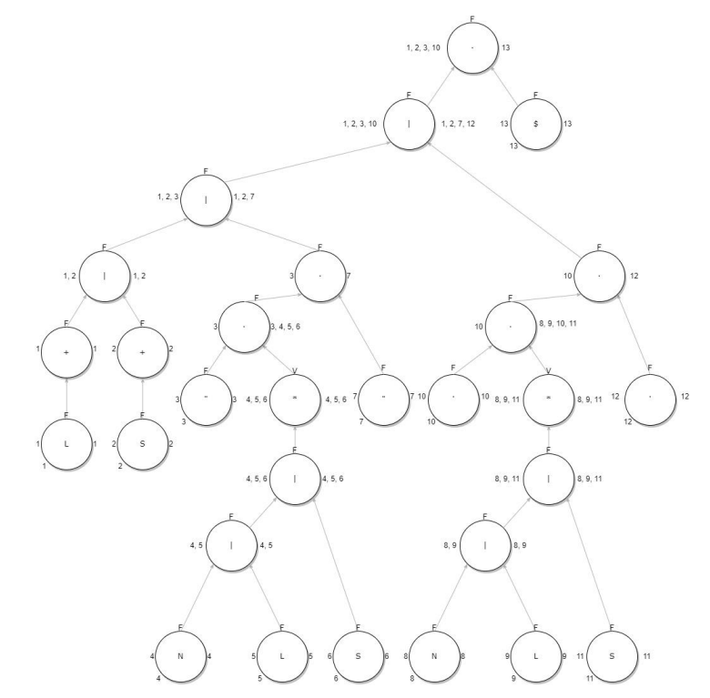
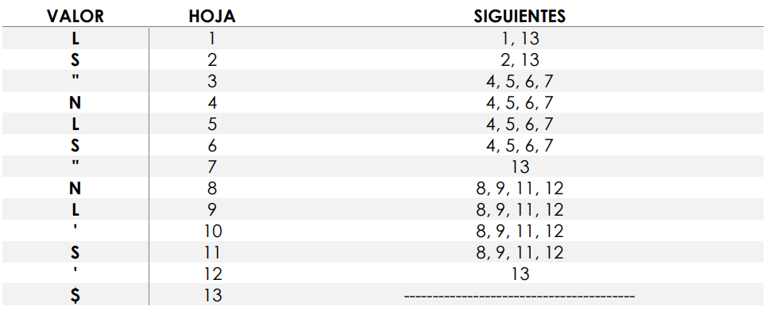
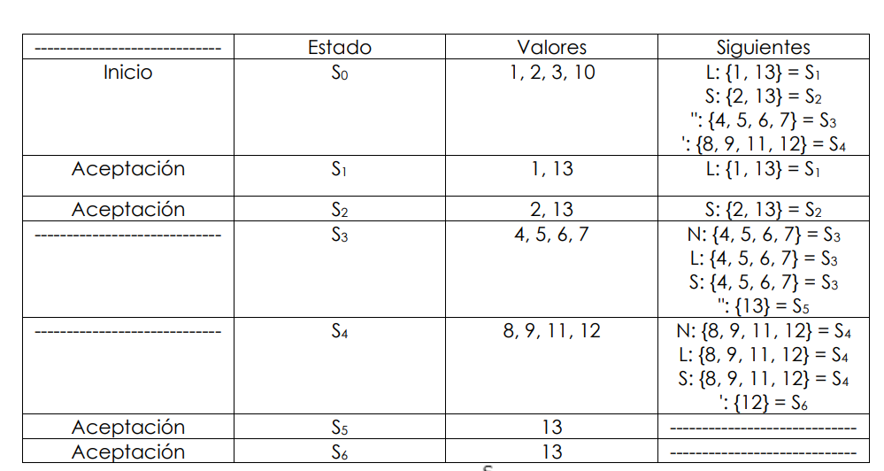
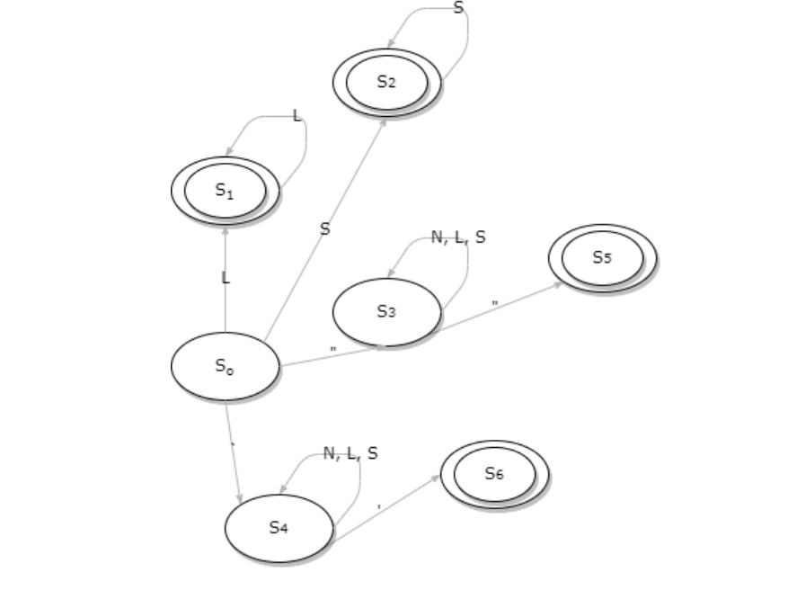

#  MANUAL TÉCNICO 
## PROYECTO 2: LABORATORIO DE LENGUAJES FORMALES Y DE PROGRAMACION 

---
Un manual técnico es un documento que va dirigido a un público con 
conocimientos técnicos sobre el área en la que estamos trabajando, 
en este caso, hablando de un proyecto de programación, va dirigido 
a una persona que tenga conocimientos en programación. 
Este documento debe contener toda la información sobre los 
recursos utilizados en el proyecto, el equipo utilizado, y una 
explicación detallada de todo lo que se ha realizado dentro del 
proyecto. 

Normalmente un manual técnico va dirigido a otros programadores 
o administradores del sistema, con la finalidad de que se pueda 
conocer de mejor manera cómo se realizó el programa y cómo 
funciona, para poder darle mantenimiento cuando se requiera, o 
hacer cambios, sin que la persona que desarrolló el sistema esté 
presente.

---
## LUGAR, FECHA Y RESPONSABLES DE LA ELABORACIÓN
---
Esta aplicación se realizó en la ciudad de Guatemala departamento 
de Guatemala, la fecha de elaboración inicio el 24 de abril de 2023, 
culminando el 30 de abril de 2023, la aplicación fue desarrollada 
por el estudiante de la Facultad de Ingeniera de la Universidad de San 
Carlos de Guatemala David Eduardo Matias Ramirez.

---
## OBJETIVOS Y ALCANCES DEL SISTEMA

---
Objetivo General: 

Combinar los conocimientos adquiridos en el curso y en los otros cursos de sistemas, para crear un compilador que traduzca el lenguaje especificado y lo transforme en Sentencias de Bases de Datos No Relacionales.

Objetivos Específicos:

- Crear una herramienta que permita el diseño de sentencias de base de datos no relacionales de una forma sencilla para el usuario. 

- Diseñar y construir un compilador que permita compilar archivos de entrada y visualizar el resultado en un entorno externo. 

- Desarrollar la habilidad del estudiante para elaborar proyectos en base a una adecuada planificación para que aprendan la manera en la que tienen que trabajar. 

La aplicación va dirigida para todas las personas que por medio de un 
archivo de texto con extensión txt, json, etc; que contenga 
información de la definicion de las sentencias que se usaran en MongoDb, asi como las características principales de cada sentencia. Luego de cargar el archivo en el sistema se podrá analizar el mismo y la aplicacion mostrara los errores lexicos y/o sintanticos que contega el archivo de entrada si este tuviera; caso contrario se procedera a traducir lo que el archivo de entrada requiere que se haga. 

---
## ESPECIFICACION TÉCNICA 

---

- 512 mb de espacio en disco duro.
- 512 md de memoria ram.
- Windows 7 o versiones en adelante. 
- Un IDE de programación.
- Equipo Intel Pentium o superior. 

---
## PARADIGMAS DE PROGRAMACION
---

### GRAMATICA LIBRE DE CONTEXTO

### EXPRESIONES REGULARES Y AFD

## PARADIGMAS

La versión de Python utilizada para la elaboración de este proyecto es 
la vr 3.9.1 

Realizada en Windows 10 x64. Disco duro de 500GB. Memoria RAM 
de 4GB. 

A continuación se presentan las clases, métodos utilizados y 
elaborados en el proyecto 2, así como una breve descripción de 
ellos. 

Variables utilizadas:

Caja Texto 1 : Contuvo el texto del archivo de entrada.

Caja Texto 2: Contuvo el texto de salida al hacer el analisis del archivo de entrada. 

Main: 

Interfaz: En este archivo se desarrollo toda la interfaz grafica del 
programa, por medio de la libreria tkinter se creo la ventana principal de nombre *principal* por medio de TK(). En la pantalla principal se manda a llamar al menu el cual contiene todos los componentes que forman parte de la 
interfaz grafica como lo son los botones de Archivo, Analisis, Tokens, Errores; adicionalmente la ventana principal contiene dos frames uno de color azul y el otro verde los cuales contienen las cajas de texto donde se puede visualizar el archivo de entrada y el de salida. 

Botones de la ventana principal:

Archivo: Al seleccionar este boton se nos desplegaran 5 opciones diferentes entre las cuales podremos: Cargar un nuevo archivo, abrir un archivo, Guardar los cambios de un archivo, Guardar Como que creara un nuevo archivo con la extension que querramos y Salir que cerrara por completo el programa.

Analisis: Al seleccionar esta opcion, el programa analizara el contenido del archivo cargado en el sistema y generara las sentencias listas para utilizar en MongoDB.

Ver Tokens: Al seleccionar esta opcion se podran visualizar todos los tokens creados al analizar el archivo de entrada.

Errores: Al seleccionar esta opcion se podra visualizar todos los errores que contuviera el archivo de entrada ya sean lexicos o sintacticos. 
