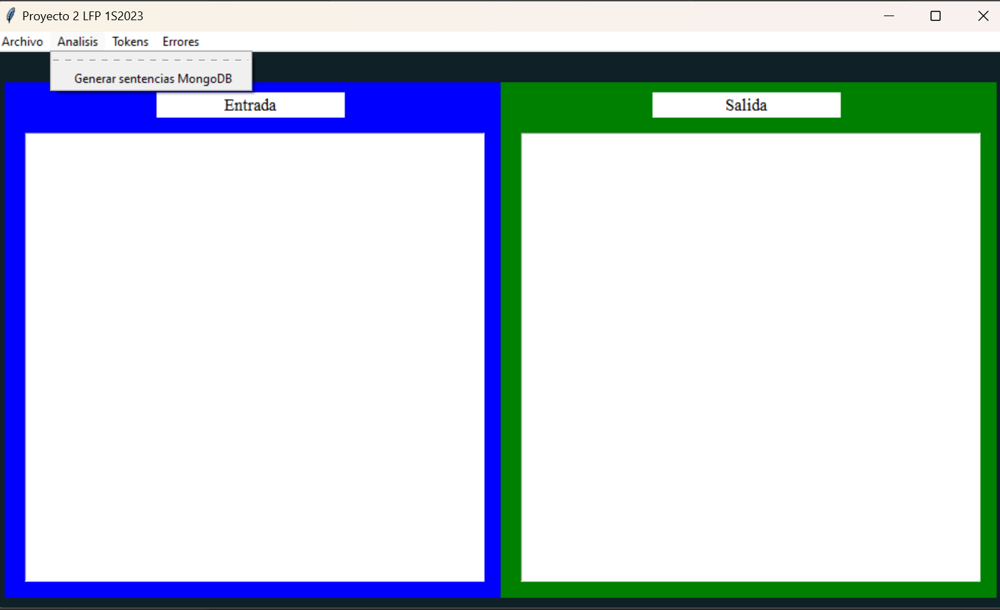

#  MANUAL DE USUARIO
## PROYECTO 2: LABORATORIO DE LENGUAJES FORMALES Y DE PROGRAMACION 

---

El manual de usuario es la documentación que proveemos a los usuarios finales para ayudarlos a tener éxito en el uso de nuestro 
sistema. Este documento se entrega junto al programa para ayudar a quien lo tenga a aprender cómo usarlo apropiadamente. En general, el manual de usuario debería poder ser entendido por cualquier usuario, y va dirigido a un público más general, el cual no necesariamente tiene conocimientos de programación. 

El manual de usuario tiene como objetivo instruir al usuario en el uso del sistema, informar de restricciones y dar solución a los problemas con los que se pueda topar durante la ejecución.

---
## OBJETIVOS DEL SISTEMA

La aplicación va dirigida para todas las personas que por medio de un 
archivo de texto con extensión txt, json, etc; que contenga 
información de la definicion de las sentencias que se usaran en MongoDb, asi como las características principales de cada sentencia. Luego de cargar el archivo en el sistema se podrá analizar el mismo y la aplicacion mostrara los errores lexicos y/o sintanticos que contega el archivo de entrada si este tuviera; caso contrario se procedera a traducir lo que el archivo de entrada requiere que se haga. 

---
## INFORMACIÓN DEL SISTEMA 

---

La aplicación desarrollada cuenta con una pantalla principal la cual 
muestra los diferentes botones en la barra de menu con los cuales podemos hacer uso de 
todas las funcionalidades del sistema. 

Las opciones disponibles son las siguientes: Archivo, Analizar, Tokens y Errores. Por medio de estas opciones el 
usuario podrá cargar archivos, editar el archivo cargado en el 
sistema, guardar el archivo cargado en el sistema con un nombre 
distinto u extensión, hacer un análisis léxico y sintactico del archivo de entrada, 
generar errores gramaticales y sintacticos del archivo de entrada si es que este los 
tuviera, visualizar la cantidad de tokens reconocidos y cerrar la aplicación.

---
## INTERFAZ
---

Pantalla Principal: Esto será lo primero que se mostrara al iniciar la 
aplicación, en la pantalla principal encontrara los diferentes botones 
con los cuales podemos hacer uso de todas las funcionalidades del 
sistema así como dos cajas de texto vacías en donde la primera servira para visualizar y editar los 
archivos que sean cargados al sistema. La segunda nos permitira visualizar la salida luego del analisis realizado. 

Menu Archivo: Al seleccionar esta opcion se nos deplegara un sub menu con 5 opciones diferentes las cuales serviran para poder manipular el archivo de entrada que querramos utilizar. 

Menu Analisis: Al seleccionar esta opcion se nos desplegara la opcion que hara que el sistema proceda a realizar un analis lexico y sintactico. Luego de eso nos generara una salida si no hubieran existido errores. 

Menu Tokens: Al seleccionar esta opcion se nos deplegara la opcion de "Ver Tokens" la cual nos permitira visualizar cuantos tokens fueron reconocidos durante el analisis realizado ya sea con o sin errores. 

Menu Errores: Al seleccionar esta opcion se nos deplegara la opcion de "Ver errores" la cual nos permitira visualizar todos los errores lexicos y/o sintacticos si hubieran existido.

